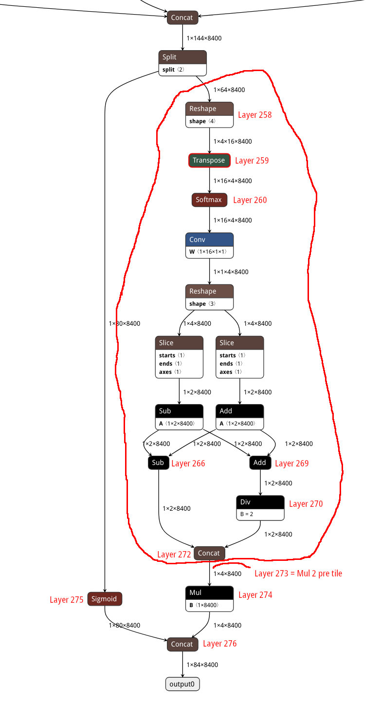
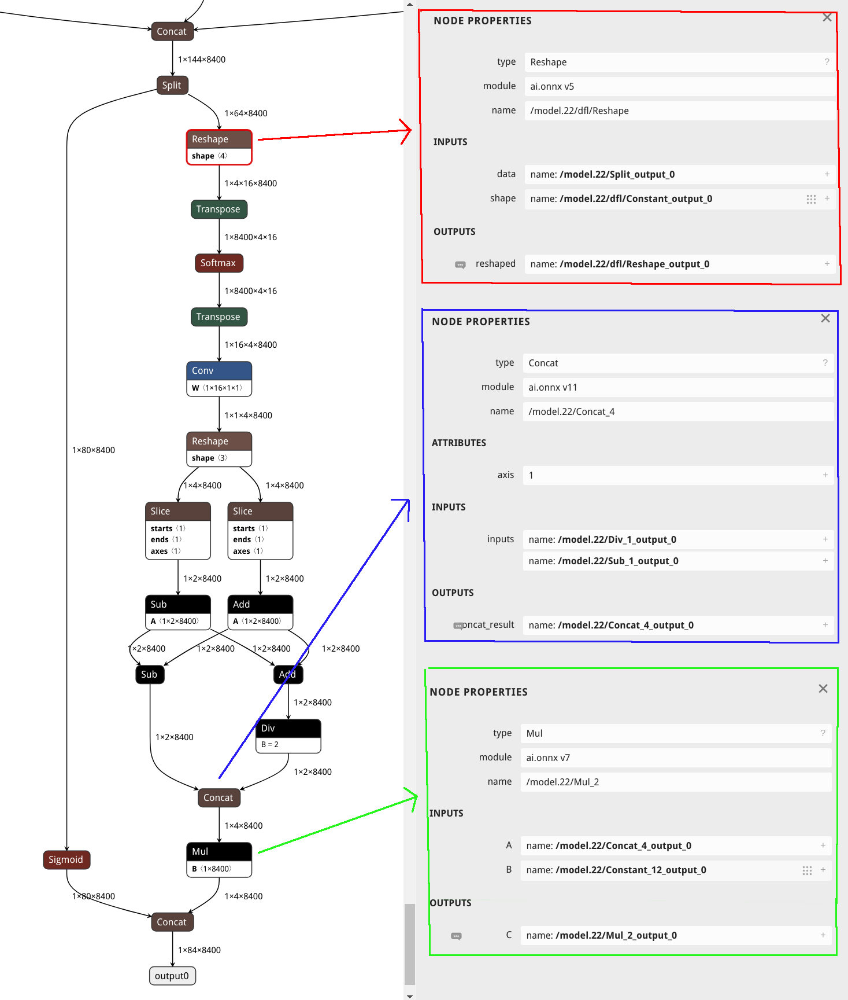

# Quantization Magic Numbers

## Vendor Magic

In the vendors [Model Hub](https://docs.radxa.com/en/orion/o6/app-development/artificial-intelligence/ai-hub) 
they provide a YOLOv8 `L` model with config file `yolov8_lbuild.cfg`  
containing quantization rules:
```
trigger_float_op = disable & <[(258, 272)]:float16_preferred!>
weight_bits = 8& <[(273,274)]:16>
activation_bits = 8& <[(273,274)]:16>
bias_bits = 32& <[(273,274)]:48>
```

Unfortunately the Model Hub requires registration so we can't link directly, but once registered such files
are [here](https://g-uaqh1479.coding.net/p/ai-model-hub/d/ai_model_hub/git/tree/master/models/ComputeVision/Object_Detection/onnx_yolov8_l).

Frustratingly there is no explanation as to how these magic numbers are selected.  Below we attempt to decode this 
and provide a method for discovering the magic numbers for other model sizes.

The numbers in brackets such as `(258,272)` refer to Layers in the cix compiled model.

Go to https://netron.app/ in your browser and load the source [yolov8l.onnx](https://modelscope.cn/models/cix/ai_model_hub_25_Q1/file/view/master/models%2FComputeVision%2FObject_Detection%2Fonnx_yolov8_l%2Fmodel%2Fyolov8l.onnx?status=2)
file to render a graph of all layers. 
Scroll down to the bottom of the graph to view the end layers.



Above I have annotated the Layer numbers according to the CIX compiler output and circled the end 
DFL (Distribution Focal Loss) layer block that is excluded from quantization.   The `Mul` operator at
the end has a `B` in its box to indicate it's a Bias bit and the `Sub` and `Add` operators in the middle
have an `A` in their box to indicate they are Activation bits.

The `trigger_float_op` config rule has number range `(258, 272)` which covers the DFL layers.  `bias_bits` has 
`(273, 274)` which covers the end `Mul` operator.   The `activation_bits` and `weight_bits` values we think are
just wrong, however them being wrong doesn't make any difference to the quantization process.

In this [quantization article](https://medium.com/@sulavstha007/quantizing-yolo-v8-models-34c39a2c10e2) it mentions
the following operators need to be excluded from quantization.

```
/model.22/Concat_3
/model.22/Split
/model.22/Sigmoid
/model.22/dfl/Reshape
/model.22/dfl/Transpose
/model.22/dfl/Softmax
/model.22/dfl/conv/Conv
/model.22/dfl/Reshape_1
/model.22/Slice_1
/model.22/Slice
/model.22/Add_1
/model.22/Sub
/model.22/Div_1
/model.22/Concat_4
/model.22/Mul_2
/model.22/Concat_5
```

These represent the DFL layers talked about above, but also include the `Concat` and `Split` operators at the top of
the graph and the `Sigmod` operator at the bottom.

After the cix compiler has quantitized the model, these operators have been excluded from quantization, so we assume the
config setting `model_domain = OBJECT_DETECTION` indicates to the compiler to exclude these operators.


## Finding Magic Numbers

Now that we understand the purpose of the Magic Numbers is to exclude the final layers of the model from quantization so
the models post processing operations are performed in full precision, next we explain how to find them for other sized
YOLO models.

Using the `yolov8s.onnx` model we create on the main [readme](../README.md) we will find the Magic Numbers for 
this `S` sized model.  Create a cix compiler config 
based off the vendors `yolov8_lbuild.cfg` file, but comment out all the quantization settings.  We have created
the file `yolov8_s_build.cfg` with contents:

```
[Common]
mode = build

[Parser]
model_type = ONNX
model_name = yolov8_s
detection_postprocess = yolo
model_domain = OBJECT_DETECTION
input_data_format = NCHW
input_model = ./model/yolov8s.onnx
input = images
input_shape = [1, 3, 640, 640]
output_dir = ./

[Optimizer]
dataset = numpydataset
calibration_data = datasets/calibration_data.npy
calibration_batch_size = 1
output_dir = ./
dump_dir = ./
quantize_method_for_activation = per_tensor_asymmetric
quantize_method_for_weight = per_channel_symmetric_restricted_range
save_statistic_info = True

# disable quantization settings
# trigger_float_op = disable & <[(258, 272)]:float16_preferred!>
# weight_bits = 8& <[(273,274)]:16>
# activation_bits = 8& <[(273,274)]:16>
# bias_bits = 32& <[(273,274)]:48>

[GBuilder]
target = X2_1204MP3
outputs = yolov8s.cix
tiling = fps
profile = True
```

Next compile the model.
```
cixbuild cfg/yolov8_s_build.cfg
```

Once compiling has finished a directory named `internal_<date>_<time>_<rand>` will be created with the
compiler results.  Load the `yolov8_s.txt` from this directory in a text editor, it will contain
all the model Layers, shapes, and `layer_id` numbers, eg:

```
layer_id=185
layer_name=/model.22/Concat_5
layer_type=Concat
layer_bottom=[/model.22/Mul_2_0,/model.22/Sigmoid_0]
layer_bottom_shape=[[1,4,8400],[1,80,8400]]
layer_bottom_type=[float32,float32]
layer_top=[/model.22/Concat_5_0]
layer_top_shape=[[1,84,8400]]
layer_top_type=[float32]
axis=1
```

Visualize the YOLO model by loading `yolov8s.onnx` into https://netron.app/ - below the end layers are shown and the
Operators of significance `Reshape`, `Concat`, and `Mul` display the Node Properties.

.

The `Reshape` node at the top is the beginning of the DFL block, search for this node `/model.22/dfl/Reshape` in the
`yolov8_s.txt` output file to reveal the layer from which we can get the Layer ID.

```
layer_id=167
layer_name=/model.22/dfl/Reshape
layer_type=Reshape
layer_bottom=[/model.22/Split_0]
layer_bottom_shape=[[1,64,8400]]
layer_bottom_type=[float32]
layer_top=[/model.22/dfl/Reshape_0]
layer_top_shape=[[1,4,16,8400]]
layer_top_type=[float32]
shape=[1,4,16,8400]
```

Find the `Concat` operator named `/model.22/Concat_4`.

```
layer_id=182
layer_name=/model.22/Concat_4
layer_type=Concat
layer_bottom=[/model.22/Div_1_0,/model.22/Sub_1_0]
layer_bottom_shape=[[1,2,8400],[1,2,8400]]
layer_bottom_type=[float32,float32]
layer_top=[/model.22/Concat_4_0]
layer_top_shape=[[1,4,8400]]
layer_top_type=[float32]
axis=1
```

Finally find the `Mul` operator named `/model.22/Mul_2`.  Becareful here as the compiler splits the `Mul` operator up
into two operations, one with a `/model.22/Mul_2_pre_tile` layer also.

```
layer_id=183
layer_name=/model.22/Mul_2_pre_tile
layer_type=Constant
layer_bottom=[]
layer_bottom_shape=[]
layer_bottom_type=[]
layer_top=[/model.22/Mul_2_pre_tile_0]
layer_top_shape=[[1,4,8400]]
layer_top_type=[float32]
weights_type=float32
weights_offset=44827780
weights_size=134400
weights_shape=[1,4,8400]

layer_id=184
layer_name=/model.22/Mul_2
layer_type=Eltwise
layer_bottom=[/model.22/Concat_4_0,/model.22/Mul_2_pre_tile_0]
layer_bottom_shape=[[1,4,8400],[1,4,8400]]
layer_bottom_type=[float32,float32]
layer_top=[/model.22/Mul_2_0]
layer_top_shape=[[1,4,8400]]
layer_top_type=[float32]
with_activation=NONE
method=MUL
```

## The Magic Rules

From the above layer information extracted from the `yolov8_s.txt` file we can now construct our quantization rules
used in the compiler `yolov8_s_build.cfg` config file.

The DFL block must be excluded from quantization in the `trigger_float_op` rule.  Our starting layer is `167` the `Reshape`
operator and ending layer is `182` the `Concat`.  Now we can construct the rule as follows:

```
trigger_float_op = disable & <[(167, 182)]:float16_preferred!>
```

The ending `Mul` operator is a Bias bit, it is split over two layers `183` and `184` to give a rule of:

```
bias_bits = 32& <[(183,184)]:48>
```

The other two uncommented rules `activation_bits` and `weight_bits` are unnecessary here, so can remain commented out.


## Final Compile

Our `yolov8_s_build.cfg` config file has now been updated with the layer's to exclude from quantization, so we can now
compile the ONNX model to CIX format and make use of the resulting `yolov8s.cix` model.

```
cixbuild cfg/yolov8_s_build.cfg
```